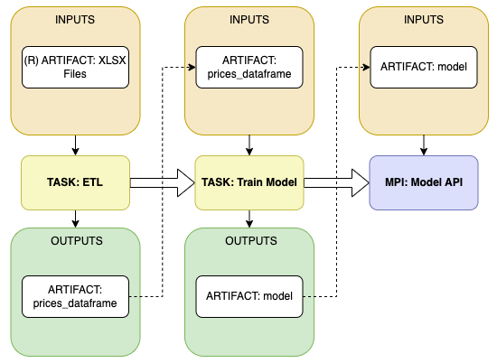

# Colombian Fruit and Veg Prices for Next-Month
## Problem Statement
### Business/Social Context

Prices represent the main vital sign of demand-supply allignment in a market. They tailor the decisions made by sellers and consumers: the former is incentiviced to produce more as prices go up while the latter purchases less when they do. Prices also reflect external shocks to the market, whether positive or negative on supply or demand, they translate into unforeseeable shifts in price levels.

In Colombia, understanding food price dynamics becomes an imperative for all market players, specially after it's general level and variace increases since the start of the COVID-19 pandemic (for instance, see Graph 1). Even in the absence of weather seasons (because of its closeness to the equatorial line) prices still are affected by external shock such as trucker strikes, road blocks, extreme wheather events (e.g. El Niño), among others that affect products and regional markets differentlly.

The relevance is greater considering that, in Colombia, the income of over half of the population is below the poverty line (COP $331.688, aprox. USD $75 per month) and agriculture provides a fifth of Colombian jobs. This two aspects of the economy reinforce the view that food prices is not just another price index that tracks the economy's health but have a significant impact on people's livelihoods and subsistence. 

Fresh food producers (farmers and ranchers) trade their products at the day's price because most of their products have short life span, in other words, they have no option but to sell at the current market price. Therefore, their income (and livelihood) vary as much as prices themselves.

### Project Purpose

In this project I analyse the price dynamics of fresh produce in Colombia and develop a visualization and forecasting tool in the hopes to help the decision making process of suppliers and consumers. Specifically, the project consist of:
* Extracting public data of monthly average prices gathered in the main informal agricultural markets ("centrales de abasto") around the country by the National Administrative Department of Statistics (DANE). 
* Develop (and run) a forecasting tool to predict the expected value for each product and market price series in next month.
* Building a visualization tool that displays the price evolution of for a given product in a given market and the next-month predicted price.
* Deploy an API that returns the next-month predicted price for a requested product and market.

## Technical Project Description
The proposed technical solution consists of a pipeline that starts with an ETL of the historical monthly aggregates of the SIPSA Food Price Survey done by DANE. Next, a time series forecasting model predicts the next-month value of the price series and persist it in a prediction artifact that will be served in an API that returns the forecasted price for the requested product and market.
Finally, an open-access dashboard would allow the user to see price evolution and forecast. Aside from the dashboard, the tasks and artifacts follow the next workflow:

### 1. Extract, Transform and Load
#### Inputs 
* Remote XLSX Files: XLSX files located at https://www.dane.gov.co/index.php/estadisticas-por-tema/agropecuario/sistema-de-informacion-de-precios-sipsa.

#### Task
* GET request each XLSX file corresponding to each year starting from 2013 up to 2022 containing the average monthly price for each product in each market.
* Clean and parse the files, convert them to pandas DataFrames and concatenate them.
* Reindex each time series to ensure each price-market price series have a continuous date index.
* Filter out the price-market price series that have any null value in the last 36 months.
* Persist the pandas DataFrame that contains only the selected time series in a pickle file.

#### Outputs
* prices_dataframe: pandas DataFrame that contains the selected time series to forecast

### 2. Time Series Forecasting
#### Inputs 
* prices_dataframe: pandas DataFrame that contains the selected time series to forecast

#### Task
* 

#### Outputs
* model: dict-class object storing the key value prediction for each product-market price series.

### API